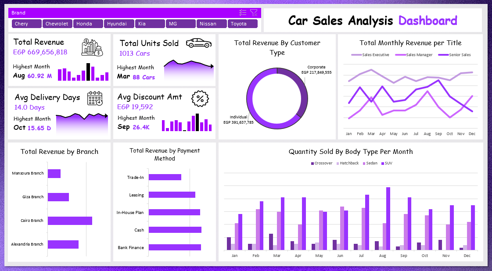

# Car Sales Analysis Dashboard

An end-to-end Excel data analysis project examining car sales performance across branches, brands, body types, payment methods, and sales staff titles — built on a normalized star-schema data model using Power Query, Power Pivot, and an interactive Excel dashboard.

---

## Dashboard Preview



---

## Project Structure

```
Car-Sales-Analytics/
│
├── Car_Sales_Project.xlsx              # Main workbook (pivot tables and dashboard)
├── car_agency_sales_Raw_Data.xlsx      # Normalized raw data (star schema)
├── Final_Dashboard.png                 # Dashboard screenshot
└── README.md                           # Project documentation
```

---

## Project Objectives

- Measure total revenue, units sold, delivery efficiency, and discount behavior across a full calendar year
- Evaluate branch performance across four Egyptian cities
- Analyze customer type contribution to total revenue (Individual vs. Corporate)
- Compare salesperson title performance by monthly revenue
- Identify the dominant vehicle body types and payment preferences

---

## Data Model Overview

The raw dataset follows a star schema with one fact table and five dimension tables.

| Table | Description |
|---|---|
| FACT_Sales | Core transactional data: sale date, price, discount, commission, delivery days, payment method |
| DIM_Car | Car attributes: brand, model, body type, model year, engine, transmission, fuel type |
| DIM_Customer | Customer demographics: name, gender, age, city, customer type (Individual / Corporate) |
| DIM_Salesperson | Salesperson details: name, title, branch, years of experience |
| DIM_Branch | Branch information: city, address, manager, year opened |
| DIM_PaymentMethod | Payment type, interest rate, and term length |

**Total Records:** 1,013 transactions across 2024

---

## Tools & Techniques

| Tool | Usage |
|---|---|
| Power Query | Data import, cleaning, type standardization, and transformation across multiple tables |
| Power Pivot | Star schema data modeling and DAX measure creation |
| Pivot Tables | Multi-dimensional aggregation across branches, months, body types, and titles |
| Excel Charts | Donut, line, bar, and clustered column visualizations |
| Slicers | Interactive brand filtering applied across all dashboard visuals |

---

## Key Performance Indicators

| KPI | Value |
|---|---|
| Total Revenue | EGP 669,656,818 |
| Total Units Sold | 1,013 cars |
| Highest Revenue Month | August — EGP 60.92M |
| Highest Units Month | March — 88 cars |
| Average Delivery Days | 14.0 days |
| Highest Delivery Month | October — 15.65 days |
| Average Discount Amount | EGP 19,592 |
| Highest Discount Month | September — EGP 26.4K |
| Average Commission | EGP 14,039 |

---

## Dashboard Visuals

**Total Revenue by Customer Type**
A donut chart comparing revenue contribution from Individual customers versus Corporate clients, used to assess client segment dependency.

**Total Monthly Revenue per Salesperson Title**
A line chart tracking monthly revenue trends across Sales Executive, Sales Manager, and Senior Sales titles throughout the year, used to evaluate title-level contribution and seasonal patterns.

**Total Revenue by Branch**
A horizontal bar chart comparing net revenue across the four branches — Cairo, Alexandria, Giza, and Mansoura — used to rank branch performance.

**Total Revenue by Payment Method**
A horizontal bar chart breaking down revenue by payment type: Bank Finance, Cash, In-House Plan, Leasing, and Trade-In, used to understand financing preferences.

**Quantity Sold by Body Type Per Month**
A clustered bar chart showing monthly unit sales broken down by body type — Crossover, Hatchback, Sedan, and SUV — used to track demand patterns across vehicle segments throughout the year.

---

## Key Insights

**1. Individual customers generate nearly double the revenue of Corporate clients.**
Individual customers account for EGP 391.6M in net revenue compared to EGP 217.8M from Corporate clients — a ratio of approximately 64% to 36%. While Corporate clients represent a meaningful segment, the business is heavily dependent on retail demand, making individual customer retention and acquisition a top strategic priority.

**2. SUVs and Sedans dominate sales volume, collectively accounting for 85% of all units sold.**
SUVs led with 444 units and Sedans with 319 units out of 891 total recorded across body type pivots. Crossovers (79 units) and Hatchbacks (49 units) remain marginal categories. This concentration signals that inventory and marketing investment should remain focused on the SUV and Sedan segments.

**3. August is the peak revenue month, but March drives the highest unit volume — revealing a price-volume divergence.**
August generated EGP 60.9M in revenue while selling 80 units, whereas March sold the most cars (88 units) but at a lower revenue of EGP 54.4M. This suggests that August transactions skew toward higher-priced models, while March volume is driven by more affordable options — a pattern relevant to promotional planning and inventory allocation.

**4. Cairo Branch is the clear revenue leader, contributing over 40% of total branch revenue.**
Cairo Branch generated EGP 232.3M compared to Alexandria at EGP 161.4M, Giza at EGP 110.3M, and Mansoura at EGP 67.8M. Mansoura, the most recently opened branch (2022), underperforms significantly — which may reflect maturity rather than structural weakness, but warrants closer monitoring.

**5. Revenue is spread relatively evenly across four payment methods, with Trade-In notably trailing.**
Bank Finance (EGP 127.1M), Cash (EGP 128.0M), and In-House Plan (EGP 124.2M) are closely clustered, while Leasing (EGP 113.2M) and Trade-In (EGP 79.1M) lag behind. The low Trade-In share suggests either limited customer awareness or uncompetitive valuation offers — an area with potential to grow financed repeat purchases.

**6. Delivery time peaks in October and May, suggesting seasonal fulfillment pressure.**
Average delivery days hit 15.65 in October and 15.60 in May — roughly 11–12% above the annual average of 14.0 days. Both months also coincide with moderate-to-high sales volumes, indicating that logistics capacity may be strained during these periods. Addressing this could improve customer satisfaction scores and reduce post-sale friction.

**7. Sales Executives generate the largest share of revenue across all months.**
Sales Executives contributed EGP 289.5M for the year compared to Senior Sales at EGP 183.0M and Sales Managers at EGP 118.2M. Notably, Sales Managers show strong spikes in August (EGP 17.5M) and December (EGP 15.2M), suggesting their involvement increases during high-value or year-end closing cycles.

---

## How to Use

1. Open `Car_Sales_Project.xlsx` in Microsoft Excel (2016 or later recommended)
2. Navigate to the **Dashboard** sheet to explore the interactive visuals
3. Use the **Brand** slicer at the top to filter all charts by manufacturer
4. Visit the **Pivots** sheet to inspect the underlying aggregations and measures
5. The raw data source is available in `car_agency_sales_Raw_Data.xlsx` for reference or further modeling

---

## Skills Demonstrated

- Star schema data modeling with Power Pivot across five dimension tables
- Data cleaning and type standardization with Power Query
- DAX measure creation (Revenue, Units Sold, AOV, Avg Delivery Days, Avg Discount, Avg Commission)
- Dashboard design with KPI cards, sparklines, and interactive slicers
- Business intelligence analysis and insight communication

---

*Part of a personal Excel Data Analysis Portfolio focused on real-world business scenarios.*
