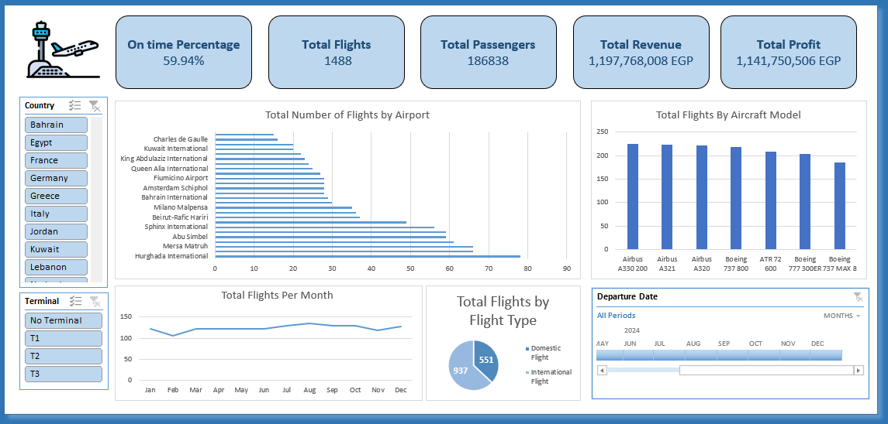

# Egyptian-Flights-Data-Analysis-Project-with-Excel



## Project Overview

An end-to-end data analysis project built on a dataset of **1,500 Egyptian flight records**, covering domestic and international routes operated by Egypt's five major carriers. The project walks through the full analytics pipeline — from raw dirty data through to a polished interactive Excel dashboard with Power Pivot measures and relationship modelling.

---

## Dataset Description

The raw dataset contains flight-level records with the following key attributes:

| Field | Description |
|---|---|
| `Flight_ID` | Unique flight identifier |
| `Airline` | Carrier name (EgyptAir, Nile Air, FlyEgypt, Air Cairo, EgyptAir Express) |
| `Aircraft_Type` | Aircraft model with manufacturer |
| `Origin_Code` / `Destination_Code` | IATA airport codes |
| `Flight_Date` | Date of departure |
| `Departure_Time` / `Arrival_Time` | Scheduled times |
| `Flight_Status` | On Time / Delayed / Cancelled / Diverted / Early |
| `Delay_Minutes` / `Delay_Reason` | Delay details where applicable |
| `Passengers_Count` | Boarded passengers |
| `Load_Factor_%` | Seat utilisation percentage |
| `Base_Fare_EGP` | Base ticket price in Egyptian Pounds |
| `Ticket_Revenue_EGP` | Total ticket revenue |
| `Fuel_Cost_EGP` | Fuel cost per flight |

---

## Data Cleaning Challenges

The raw file was intentionally uncleaned to simulate real-world data quality issues. The following transformations were applied:

### Columns Requiring Splitting
- **`Route`** — Origin and Destination were merged with ` → ` separator; split back into two separate columns
- **`Departure_DateTime`** — Date and time were concatenated into a single text field; split on space into `Flight_Date` and `Departure_Time`
- **`Gate_Terminal`** — Two inconsistent formats (`Gate:D13 / T1` and `D13T1`) required conditional parsing to extract Gate and Terminal separately

### Columns Requiring Cleaning
- **`Aircraft_Type`** — Mixed casing (UPPER / lower / Title) with leading/trailing whitespace; resolved with TRIM + PROPER, then split into `Manufacturer` and `Model`
- **`Delay_Reason`** — Inconsistent null representations (`N/A`, `None`, `""`, blank) and mixed casing; standardised to a consistent controlled vocabulary
- **`Load_Factor_%`** — Mixed data types: numeric decimals, `"85%"` text strings, and `"N/A"` entries; normalised to a clean decimal format

### Data Quality Issues
- **12 missing `Flight_ID`** values — reconstructed from `Flight_Number` + `Departure_DateTime`
- **5 duplicate rows** — identified and removed during deduplication step

---

## Data Model & Relationships

Three dimension tables were built and linked to the fact table in Power Pivot:
```
Flights_Raw (Fact)
    ├── dim_Airports   → on Origin_Code / Destination_Code = Airport_Code
    ├── dim_Airlines   → on Airline = Airline_Name
    └── dim_Aircraft   → on Aircraft_Type = Aircraft_Type
```

Relationships were created in **Power Pivot → Diagram View** with one-to-many cardinality from each dimension to the fact table.

---

## DAX Measures

The following measures were created in Power Pivot:
```dax
-- On-Time Rate
On Time Rate =
DIVIDE(
    CALCULATE(COUNTROWS('Flights_Raw'), 'Flights_Raw'[Flight_Status] = "On Time"),
    COUNTROWS('Flights_Raw')
)

-- Cancellation Rate
Cancellation Rate =
DIVIDE(
    CALCULATE(COUNTROWS('Flights_Raw'), 'Flights_Raw'[Flight_Status] = "Cancelled"),
    COUNTROWS('Flights_Raw')
)

-- Total Profit
Total Profit =
SUMX('Flights_Raw', 'Flights_Raw'[Ticket_Revenue_EGP] - 'Flights_Raw'[Fuel_Cost_EGP])

-- Revenue per Passenger
Revenue per Passenger =
DIVIDE(SUM('Flights_Raw'[Ticket_Revenue_EGP]), SUM('Flights_Raw'[Passengers_Count]))

-- Average Load Factor
Avg Load Factor =
AVERAGE('Flights_Raw'[Load_Factor_%])
```

---

## Dashboard

The final dashboard was built in **Excel with PivotCharts and Slicers** connected to the Power Pivot data model.

### KPI Cards
| Metric | Value |
|---|---|
| On-Time Rate | 59.94% |
| Total Flights | 1,488 |
| Total Passengers | 186,838 |
| Total Revenue | 1,197,768,008 EGP |
| Total Profit | 1,141,750,506 EGP |

### Visuals Included
- **Total Flights by Airport** — horizontal bar chart ranked by volume
- **Total Flights by Aircraft Model** — column chart across all 7 aircraft types
- **Total Flights per Month** — line chart showing seasonal trend (Jan–Dec)
- **Flights by Flight Type** — pie chart (On Time vs Delayed/Other)
- **Slicers** — Country, Terminal, and Departure Date timeline for interactive filtering

---

## 🛠️ Tools Used

| Tool | Purpose |
|---|---|
| Microsoft Excel | Data cleaning, modelling, and dashboard |
| Power Query | Data transformation and column splitting |
| Power Pivot | Data model and DAX measures |
| PivotTables & PivotCharts | Dashboard visualisations |
| Excel Slicers & Timelines | Interactive filtering |

---

## Repository Structure
```
├── egyptian_flights_dirty.xlsx     # Raw uncleaned dataset with dim sheets
├── Fact Flights.xlsx               # Fact Sheet with the Dashboard inside
├── Dim Sheets.xslx                 # Dimenstion Sheets File
├── dashboard.png                   # Dashboard screenshot
└── README.md                       # This file
```

---

## How to Use

1. Clone or download the repository
2. Open `egyptian_flights_dirty.xlsx` to explore the raw data and cleaning notes sheet
3. Open `Fact Flights.xlsx` to interact with the final dashboard
4. Use the **Country**, **Terminal**, and **Departure Date** slicers to filter all visuals simultaneously

---

## Author

> Project completed as part of a data analytics portfolio.  
> Built with Microsoft Excel · Power Query · Power Pivot · DAX
