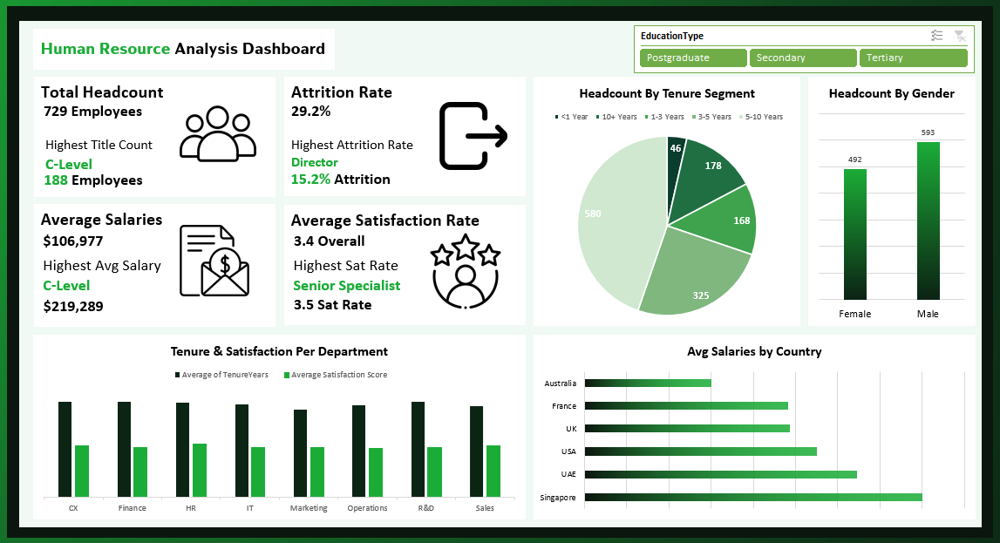

# Human Resource Analysis Dashboard

An end-to-end Excel data analysis project examining workforce composition, attrition, compensation, and satisfaction across departments, job titles, countries, and tenure segments — built on a normalized star-schema data model using Power Query, Power Pivot, and an interactive Excel dashboard.

---

## Dashboard Preview



---

## Project Structure

```
HR-Analytics/
│
├── HR_Project.xlsx                # Main workbook (pivot tables and dashboard)
├── HR_Train_Dataset.xlsx          # Normalized raw data (star schema)
├── Final_Dashboard.png            # Dashboard screenshot
└── README.md                      # Project documentation
```

---

## Project Objectives

- Measure total headcount, attrition rate, average salary, and satisfaction score across the organization
- Evaluate workforce distribution by gender, tenure segment, and department
- Analyze compensation benchmarks across job titles and countries
- Identify the highest-attrition roles and departments to support retention planning
- Track average tenure and satisfaction by department to inform engagement strategy

---

## Data Model Overview

The raw dataset follows a star schema with one fact table and five dimension tables.

| Table | Description |
|---|---|
| Fact_HR | Core employee records: salary, bonus, tenure, satisfaction score, attrition flag, training hours, absent days |
| Dim_Department | Department name and division classification |
| Dim_JobTitle | Job title, seniority level, and role category |
| Dim_Location | City, country, and regional classification |
| Dim_Education | Education level and type (Secondary, Tertiary, Postgraduate) |
| Dim_Performance | Performance band, numeric rating, and band category |

**Total Records:** 3,000 employee records across FY 2021 – FY 2024

---

## Tools & Techniques

| Tool | Usage |
|---|---|
| Power Query | Data import, cleaning, type standardization, and transformation across multiple tables |
| Power Pivot | Star schema data modeling and DAX measure creation |
| Pivot Tables | Multi-dimensional aggregation across departments, titles, countries, and tenure bands |
| Excel Charts | Pie, bar, and clustered column visualizations |
| Slicers | Interactive education type filtering applied across all dashboard visuals |

---

## Key Performance Indicators

| KPI | Value |
|---|---|
| Total Headcount | 729 Employees |
| Attrition Rate | 29.2% |
| Highest Attrition Role | Director — 15.2% |
| Average Salary | $106,977 |
| Highest Avg Salary Title | C-Level — $219,289 |
| Average Satisfaction Score | 3.4 / 5.0 |
| Highest Satisfaction Title | Senior Specialist — 3.5 |

---

## Dashboard Visuals

**Headcount by Tenure Segment**
A pie chart segmenting the workforce into five tenure bands — under 1 year, 1–3 years, 3–5 years, 5–10 years, and 10+ years — used to assess workforce stability and identify high-risk attrition cohorts.

**Headcount by Gender**
A bar chart comparing male and female employee counts across the organization, used to assess gender representation.

**Tenure and Satisfaction per Department**
A clustered bar chart displaying average tenure years and average satisfaction scores side by side for each department, used to identify engagement gaps relative to workforce experience.

**Average Salaries by Country**
A horizontal bar chart ranking all six operating countries by average employee salary, used to benchmark compensation competitiveness across markets.

---

## Key Insights

**1. The overall attrition rate of 29.2% is critically high and demands immediate retention intervention.**
Nearly one in three employees has left the organization, far exceeding typical industry benchmarks. The urgency is amplified by the fact that Director-level roles — among the most costly to replace — carry the highest individual attrition rate at 15.2%, followed by Information Technology and Finance as the most affected departments.

**2. The workforce is concentrated in the 5–10 year tenure band, masking a significant early-attrition problem.**
580 employees fall within the 5–10 year segment, suggesting a stable mid-career core. However, employees with under one year of tenure are exiting at a disproportionate rate, indicating that onboarding programs and early engagement initiatives are failing to convert new hires into long-term contributors.

**3. A gender imbalance exists, with male employees outnumbering female employees by 101 headcount.**
The workforce comprises 593 male and 492 female employees. While not extreme, the gap points to potential inequities in hiring pipelines or retention rates that merit further investigation, particularly within specific departments or seniority levels.

**4. C-Level roles command compensation nearly double the organizational average, yet satisfaction declines at senior levels.**
C-Level employees average $219,289 annually — more than twice the $106,977 organizational average. Despite this, VP-level employees register the lowest satisfaction scores across all job titles, suggesting that beyond a compensation threshold, factors such as workload, autonomy, and strategic alignment become the primary drivers of dissatisfaction.

**5. France, Singapore, and the UAE offer the highest average salaries, while Australia trails all other markets.**
Country-level salary variation is meaningful, with France leading at approximately $110,795 and Australia recording the lowest average. This differential may create talent acquisition and retention challenges in lower-paying markets, particularly when competing against multinational employers offering globally benchmarked compensation.

**6. Senior Specialist roles achieve the highest satisfaction scores, outperforming all other titles including leadership tiers.**
Senior Specialists report the highest average satisfaction at 3.5, slightly above the organizational average of 3.4. This suggests that structured, senior-level individual contributor career paths — where employees have mastered their domain without management responsibilities — correlate positively with workplace satisfaction.

**7. Departmental satisfaction and tenure do not move in tandem, indicating that experience alone does not drive engagement.**
Departments with higher average tenure do not consistently record higher satisfaction scores. This decoupling implies that long-tenured employees may remain with the organization out of inertia rather than genuine engagement — a risk factor for productivity and cultural health that satisfaction surveys alone cannot fully capture.

---

## How to Use

1. Open `HR_Project.xlsx` in Microsoft Excel (2016 or later recommended)
2. Navigate to the **Dashboard** sheet to explore the interactive visuals
3. Use the **Education Type** slicer at the top to filter all charts by Secondary, Tertiary, or Postgraduate
4. Visit the **Pivots** sheet to inspect the underlying aggregations and measures
5. The raw data source is available in `HR_Train_Dataset.xlsx` for reference or further modeling

---

## Skills Demonstrated

- Star schema data modeling with Power Pivot across five dimension tables
- Data cleaning and type standardization with Power Query
- DAX measure creation (Headcount, Attrition Rate, Average Salary, Average Satisfaction, Tenure Segmentation)
- Dashboard design with KPI cards and interactive slicers
- Business intelligence analysis and HR insight communication

---

*Part of a personal Excel Data Analysis Portfolio focused on real-world business scenarios.*
