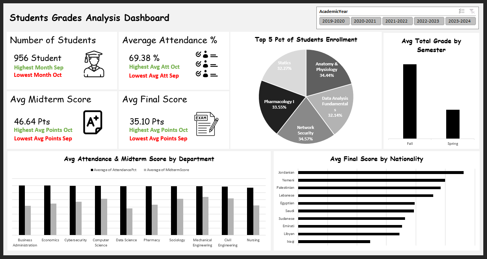

# Students Grades Analysis Dashboard

An interactive Excel dashboard built on a star schema data model using Power Query, Power Pivot, and DAX measures. The dashboard enables academic performance analysis across departments, nationalities, semesters, and academic years through a single-page layout with dynamic slicers.

---

## Dashboard Preview



---

## Project Files

| File | Description |
|---|---|
| `Student_Dataset_Training.xlsx` | Source workbook containing the fact table, 5 dimension tables, cleaned Power Query steps, data model, DAX measures, and the final dashboard |
| `Training_Guide_PowerQuery_KPIs.txt` | Full documentation of cleaning steps, KPI definitions, DAX formulas, and chart guidance |

---

## Data Model

The model follows a **star schema** with one fact table and five dimension tables.

```
Dim_Faculty
    └── Dim_Department ──┬── Fact_Enrollments ──── Dim_Course
                         ├── Dim_Instructor
                         └── Dim_AcademicYear
```

### Tables

| Table | Type | Rows | Description |
|---|---|---|---|
| `Fact_Enrollments` | Fact | 3,000 | One row per student–course enrollment |
| `Dim_Department` | Dimension | 10 | Department names and faculty mapping |
| `Dim_Faculty` | Dimension | 5 | Faculty names and campus |
| `Dim_Course` | Dimension | 15 | Course details, credits, and semester |
| `Dim_Instructor` | Dimension | 10 | Instructor rank, hire date, department |
| `Dim_AcademicYear` | Dimension | 5 | Academic year labels and date ranges |

### Relationships

| From | To | Cardinality |
|---|---|---|
| `Fact_Enrollments[DepartmentID]` | `Dim_Department[DepartmentID]` | Many-to-One |
| `Fact_Enrollments[CourseID]` | `Dim_Course[CourseID]` | Many-to-One |
| `Fact_Enrollments[InstructorID]` | `Dim_Instructor[InstructorID]` | Many-to-One |
| `Fact_Enrollments[AcademicYearID]` | `Dim_AcademicYear[AcademicYearID]` | Many-to-One |
| `Dim_Department[FacultyID]` | `Dim_Faculty[FacultyID]` | Many-to-One |
| `Dim_Course[DepartmentID]` | `Dim_Department[DepartmentID]` | Many-to-One |
| `Dim_Instructor[DepartmentID]` | `Dim_Department[DepartmentID]` | Many-to-One |

---

## Power Query — Data Cleaning Steps

The raw fact table contains intentional dirty data across several non-key columns. The following transformations are applied in Power Query before loading into the data model.

| Step | Column | Issue | Transformation |
|---|---|---|---|
| 1 | `GradeLetter` | Inconsistent casing and free-text variants (`a`, `Excellent`, `FAIL`) | Custom column with nested `if` to map all variants to A / B / C / D / F |
| 2 | `StudentStatus` | Mixed casing, trailing spaces, abbreviations (`grad`, `on leave`) | Trim → Capitalize Each Word → Replace remaining non-standard values |
| 3 | `Gender` | Mixed casing and single-letter codes (`M`, `f`, `FEMALE`) | Custom column using `Text.Lower()` to normalize to Male / Female |
| 4 | `Scholarship` | Mixed formats (`YES`, `Y`, `1`, `no`) | Custom column mapping all variants to Yes / No |
| 5 | `AttendancePct` | Values > 100, negative values, text placeholders (`N/A`, `Absent`) | Change type to Decimal → Replace Errors with null → Custom column to null out-of-range values |
| 6 | `MidtermScore` | Out-of-range values (`999`, `-10`), text (`absent`), nulls | Same pattern as AttendancePct — type change, error replacement, range filter |
| 7 | `ExamDate` | Mixed date formats, placeholders (`TBD`, `N/A`, `#VALUE!`) | Add `ExamDate_Status` flag column: Valid / Invalid — teaches error flagging rather than forced cleaning |

> **Foreign key columns** (`DepartmentID`, `CourseID`, `InstructorID`, `AcademicYearID`) contain **no missing values** and require no cleaning.
> **`EnrollmentDate`** is fully clean with consistent `YYYY-MM-DD` formatting.

---

## DAX Measures

| # | Measure | Description |
|---|---|---|
| 1 | `Total Enrollments` | `COUNTROWS` of the fact table |
| 2 | `Avg Final Score` | `AVERAGEX` over non-blank final scores |
| 3 | `Pass Rate %` | Share of records with `TotalGrade >= 50` using `DIVIDE` |
| 4 | `Scholarship Rate %` | Share of enrollments flagged as scholarship |
| 5 | `Avg Attendance %` | `AVERAGEX` over valid attendance values (0–100) |
| 6 | `Withdrawal Rate %` | Share of records with `StudentStatus = "Withdrawn"` |
| 7 | `A Grade Rate %` | Share of records where `GradeLetter = "A"` |
| 8 | `YoY Enrollment Growth %` | `VAR` + `CALCULATE` pattern comparing current vs. prior academic year |

---

## Dashboard Components

### KPI Cards (Top Row)

| Card | Metric | Supporting Detail |
|---|---|---|
| Number of Students | Total unique enrollments | Highest month / Lowest month |
| Average Attendance % | Mean attendance across valid records | Highest and lowest average month |
| Avg Midterm Score | Mean midterm score | Highest and lowest average month |
| Avg Final Score | Mean final exam score | Highest and lowest average month |

### Charts

| Visual | Type | Axes / Fields |
|---|---|---|
| Top 5 Pct of Students Enrollment | Pie Chart | Course Name → % share of enrollments |
| Avg Total Grade by Semester | Bar Chart | Semester (Fall / Spring) → Avg TotalGrade |
| Avg Attendance & Midterm Score by Department | Clustered Bar | Department → Avg AttendancePct + Avg MidtermScore |
| Avg Final Score by Nationality | Horizontal Bar | Nationality → Avg FinalScore |

### Slicer

| Slicer | Field | Connected To |
|---|---|---|
| Academic Year | `Dim_AcademicYear[AcademicYear]` | All visuals on the dashboard |

---

## Key Findings (All Years Combined)

- Total student enrollments: **956 students** across all recorded periods
- Average attendance rate: **69.38%**
- Average midterm score: **46.64 pts** out of 50
- Average final score: **35.10 pts** out of 50
- Top enrolled course: **Anatomy & Physiology** (34.44% share among top 5)
- Fall semester students record a higher average total grade than Spring semester students
- Jordanian students achieve the highest average final score by nationality; Iraqi students record the lowest
- September records the highest enrollment volume but the lowest average attendance and scores, suggesting a concentration of lower-performing early-semester records

---

## Tools & Skills Demonstrated

- **Power Query** — data type handling, custom columns, error replacement, value standardization, flag columns
- **Power Pivot** — star schema modeling, relationship management, diagram view
- **DAX** — `COUNTROWS`, `AVERAGEX`, `DIVIDE`, `FILTER`, `CALCULATE`, `VAR` / `RETURN` pattern
- **Excel Dashboard Design** — KPI card layout, chart selection, slicer integration, consistent visual style

---

## How to Use

1. Open `Student_Dataset_Training.xlsx` in Excel (2016 or later recommended).
2. Navigate to the **Data** tab → **Queries & Connections** to review Power Query steps.
3. Open **Power Pivot** → **Manage** to inspect the data model and DAX measures.
4. Go to the **Dashboard** sheet and use the **Academic Year** slicer to filter all visuals.
5. Refer to `Training_Guide_PowerQuery_KPIs.txt` for the full cleaning guide, DAX code, and teaching sequence.