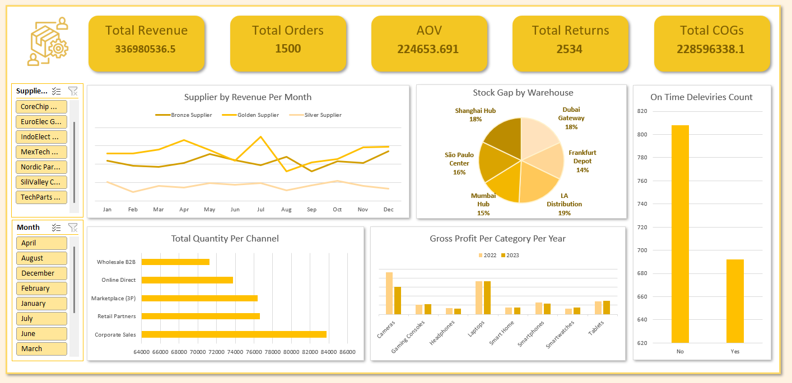

# Supply Chain Analytics Dashboard

An end-to-end Excel data analysis project focused on supply chain performance across suppliers, warehouses, sales channels, and product categories — built using Power Query, Power Pivot, and an interactive Excel dashboard.

---

## Dashboard Preview



---

## Project Structure

```
Supply-Chain-Analytics/
│
├── Supply_Chain_Project_Full.xlsx    # Main workbook (raw data, pivot tables, dashboard)
├── final_dashboard.png               # Dashboard screenshot
└── README.md                         # Project documentation
```

---

## Project Objectives

- Track and analyze revenue, orders, and profitability across a global supply chain
- Evaluate supplier performance across Bronze, Golden, and Silver tiers over 12 months
- Identify stock gaps across international warehouses
- Compare gross profit by product category across 2022 and 2023
- Monitor on-time delivery rates and sales channel distribution

---

## Dataset Overview

| Field | Description |
|---|---|
| Transaction ID | Unique identifier per order |
| Order Date | Date of transaction (2022–2023) |
| Supplier | One of 7 suppliers across Bronze, Golden, and Silver tiers |
| Product Category | Cameras, Gaming Consoles, Headphones, Laptops, Smart Home, Smartphones, Smartwatches, Tablets |
| Sales Channel | Corporate Sales, Retail Partners, Marketplace (3P), Online Direct, Wholesale B2B |
| Warehouse | Dubai Gateway, Frankfurt Depot, LA Distribution, Mumbai Hub, São Paulo Center, Shanghai Hub |
| Order Quantity | Units ordered per transaction |
| Return Quantity | Units returned |
| Total Revenue (USD) | Revenue generated per transaction |
| Total COGs (USD) | Cost of Goods Sold |
| Gross Profit (USD) | Revenue minus COGs |
| On-Time Delivery | Whether the order was delivered on time (Yes / No) |
| Stock Gap | Difference between supply and demand at the warehouse level |

**Total Records:** 1,500 transactions

---

## Tools & Techniques

| Tool | Usage |
|---|---|
| Power Query | Data import, cleaning, and transformation |
| Power Pivot | Data modeling and DAX measures |
| Pivot Tables | Aggregation and slicing across dimensions |
| Excel Charts | Line, bar, pie, and clustered column visualizations |
| Slicers | Interactive filtering by supplier and month |

---

## Key Performance Indicators

| KPI | Value |
|---|---|
| Total Revenue | $336,980,536.53 |
| Total Orders | 1,500 |
| Average Order Value (AOV) | $224,653.69 |
| Total Returns | 2,534 units |
| Total Cost of Goods Sold | $228,596,338.12 |
| Total Gross Profit | $133,829,761.61 |

---

## Dashboard Visuals

**Supplier Revenue Per Month**
A line chart comparing monthly revenue contribution across Bronze, Golden, and Silver supplier tiers throughout the year, used to identify seasonal patterns and supplier dominance over time.

**Stock Gap by Warehouse**
A pie chart showing the distribution of stock gaps across six global warehouses — Dubai Gateway, Frankfurt Depot, LA Distribution, Mumbai Hub, São Paulo Center, and Shanghai Hub — used to flag supply-demand imbalances by location.

**Total Quantity Per Channel**
A horizontal bar chart breaking down total order quantities across five sales channels, used to assess channel performance and prioritize fulfillment capacity.

**Gross Profit Per Category Per Year**
A clustered bar chart comparing gross profit by product category for 2022 versus 2023, used to evaluate category-level profitability trends and year-over-year shifts.

**On-Time Deliveries Count**
A bar chart showing the volume of on-time versus delayed deliveries, used to measure logistics reliability and highlight fulfillment gaps.

---

## Key Insights

**1. Golden suppliers are the primary revenue driver, but performance is inconsistent.**
Golden-tier suppliers account for the largest share of annual revenue at $158M, significantly ahead of Bronze ($129M) and Silver ($50M). However, their monthly revenue shows notable volatility — peaking in July at $17.4M and dropping to $8M in August — suggesting dependency on a few high-volume orders rather than a stable demand base.

**2. LA Distribution and Dubai Gateway carry the highest unmet demand.**
LA Distribution leads all warehouses in stock gap at 19% of the total, followed by Dubai Gateway and Shanghai Hub at 18% each. These three locations collectively account for 55% of all stock gaps, pointing to systemic forecasting or replenishment issues concentrated in high-traffic distribution hubs.

**3. Cameras and Laptops dominate gross profit, but Cameras show a significant year-over-year decline.**
Cameras generated $23.2M in gross profit in 2022 but dropped to $15.2M in 2023 — a decline of approximately 35%. Laptops, by contrast, remained stable at roughly $18M in both years, making them the more reliable top-margin category. This divergence warrants a closer review of camera pricing, competition, or demand shifts.

**4. Corporate Sales leads in volume, but channel distribution is relatively balanced.**
Corporate Sales accounts for the highest order quantity at 83,726 units, followed by Retail Partners (76,620) and Marketplace (3P) (76,392). The narrow gap between channels suggests no single channel is at risk of over-reliance, though Wholesale B2B trails at 71,259 units and may benefit from targeted growth initiatives.

**5. On-time delivery performance is below acceptable thresholds.**
Of the 1,500 orders, only 692 were delivered on time (approximately 46%), while 808 were delayed. This means more than half of all orders missed their delivery window — a critical operational issue that directly impacts customer satisfaction and correlates with the elevated return count of 2,534 units.

---

## How to Use

1. Open `Supply_Chain_Project_Full.xlsx` in Microsoft Excel (2016 or later recommended)
2. Navigate to the **Dashboard** sheet to explore the interactive charts
3. Use the **Supplier** and **Month** slicers on the left panel to filter all visuals dynamically
4. Visit the **Pivots** sheet to inspect the underlying aggregations and DAX measures

---

## Skills Demonstrated

- Data cleaning and transformation with Power Query
- Relational data modeling with Power Pivot
- DAX measure creation (Revenue, AOV, Gross Profit, COGs)
- Dashboard design and layout in Excel
- Business intelligence analysis and insight communication

---

*Part of a personal Excel Data Analysis Portfolio focused on real-world business scenarios.*